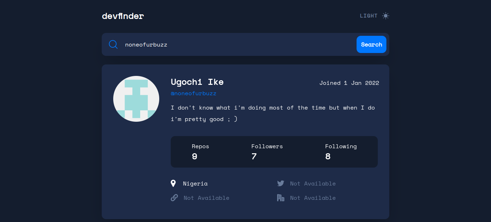
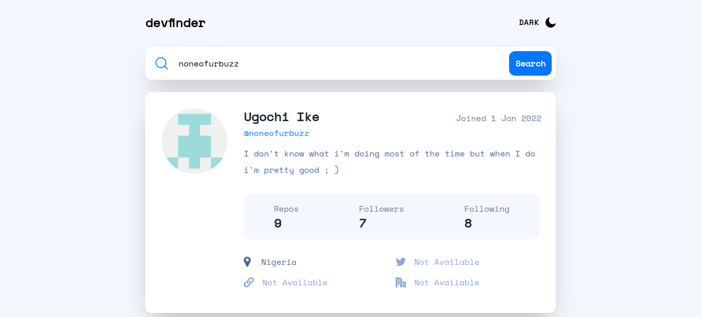
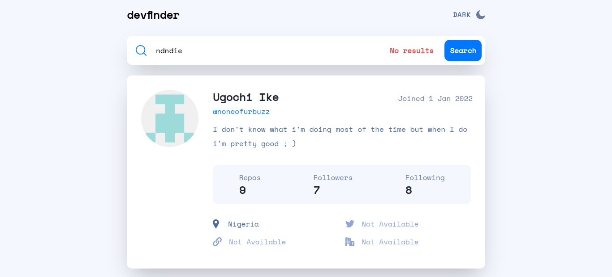

# Github User Search App

## Table of contents

- [Overview](#overview)
  - [Screenshot](#screenshot)
  - [Links](#links)
- [My process](#my-process)
  - [Built with](#built-with)
  - [What I learned](#what-i-learned)

## Overview

### Screenshot

#### Dark theme

#### Light theme

#### Error checks

### Links

- Live Site URL: [Live Site](https://gregarious-pudding-4c759b.netlify.app/)

## My process

### Built with

- [React](https://react.dev/) 
- [Tailwind CSS](https://tailwindcss.com/)

### What I learned

It was really fun to practice using the github users API and I learnt a lot about react and APIs from these challenge

